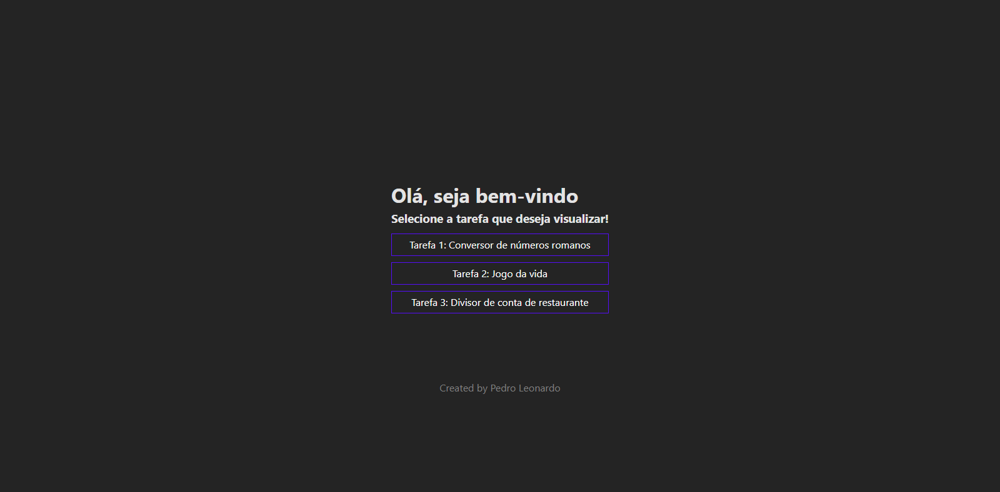
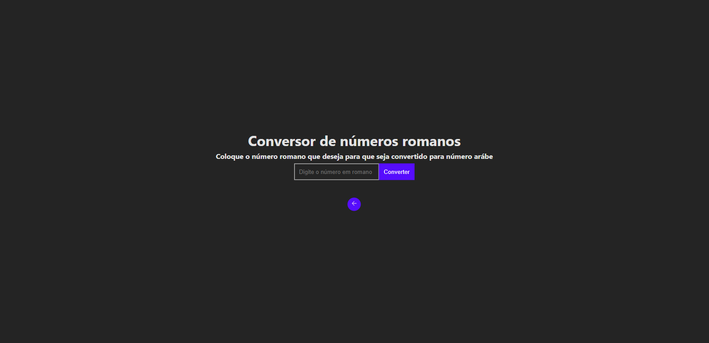
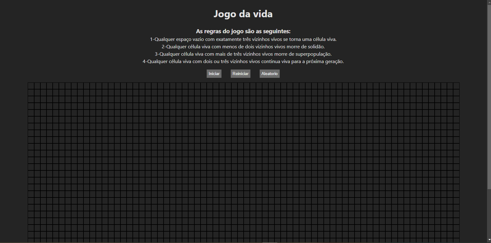
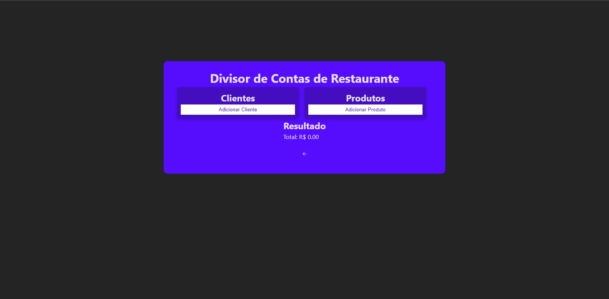

<h1 align="center": center">Teste de Programação</h1>
<h2>Tela Inicial:</h2>

Na tela inicial contém o espaço onde o usúario pode selecionar qual tarefa deseja verificar.

                                                            
<h2>Tarefa 1: Conversor de Números Romanos</h2>

Na tarefa 1, o usúario pode colocar o número romano que deseja para ser convertido a arábico.

                                                             
<h2>Tarefa 2: Jogo da Vida</h2>

Na tarefa 2, o usúario pode jogar o jogo da vida onde preenche os espaços que desejar.
                                                             
                                                           
<h2>Tarefa 3: Divisor de conta de restaurante</h2>

Na tarefa 3, o usúario pode escolher a quantidade de clientes e produtos com a opcção de implementar 10% de serviço no determinado produto que consumiu.
                                                             
<h3>Tecnologias usadas:</h3>
<ul>
    <li>React.Js + TypeScript</li>
                                                           
</ul>

